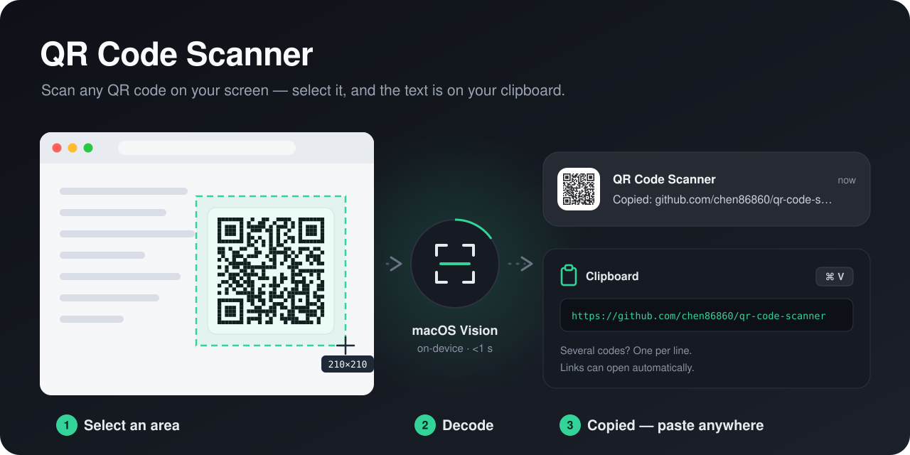

# QR Code Scanner

[](https://github.com/chen86860/qr-code-scanner/actions/workflows/ci.yml)



A Raycast extension that scans QR codes on your screen. Select an area (or capture every display),
and the decoded text is copied to your clipboard. URLs can optionally be opened right away.

It also runs in Raycast-compatible launchers that execute Raycast extensions.

## Features

- **Native decoding.** Uses the macOS Vision framework instead of a JavaScript image pipeline: a
  full Retina display decodes in under a second, with no image libraries at all (the command bundle
  is about 1 KB).
- **Several codes at once.** Every QR / Micro QR code in the capture is copied, one per line.
- **Native feedback.** Results go through Raycast's own APIs: the clipboard, a HUD, and `open`, which
  respects each URL's registered app (deep links open in their app, not the browser).
- **Safe URL opening.** Only `http`, `https`, `ftp` and `mailto` links, plus bare domains such as
  `example.com/path`, are ever opened; everything else is just copied.

## Preferences

| Preference          | Default   | Description                                                             |
| ------------------- | --------- | ----------------------------------------------------------------------- |
| Capture Mode        | Selection | _Selection_ lets you drag an area; _Entire Screen_ scans every display. |
| Silence Mode        | off       | Skip the shutter sound.                                                 |
| Open URL After Scan | off       | Open a decoded URL instead of only copying it.                          |

## Permissions

macOS asks for **Screen Recording** permission for your launcher the first time you scan
(System Settings → Privacy & Security → Screen & System Audio Recording).

## How it works

```
Scan QR Code (src/scan-qr-code.ts)
  ├─ osascript -l JavaScript assets/scan-qr.js <mode> <silence>
  │    ├─ /usr/sbin/screencapture   (-i selection, or one file per display)
  │    ├─ VNDetectBarcodesRequest   (QR + Micro QR)
  │    └─ prints {"status":"ok","codes":[…]} | cancelled | not-found
  └─ Clipboard.copy → open (optional) → showHUD
```

`assets/scan-qr.js` is JavaScript for Automation (JXA) because `osascript` executes it directly. It
only captures and decodes; everything the user sees is TypeScript in `src/` and unit-tested.

## Development

Requires macOS, Node 22+ and pnpm 11 (`corepack enable`).

```sh
pnpm install
pnpm dev        # ray develop — load it into Raycast
pnpm build      # production build into ./dist (also generates raycast-env.d.ts)
pnpm lint       # ray lint: ESLint + Prettier + manifest checks
pnpm typecheck  # needs raycast-env.d.ts, so run build or dev once first
pnpm test       # vitest
```

## Credits

Based on the [QR Code Scanner](https://github.com/raycast/extensions/tree/main/extensions/qr-code-scanner)
Raycast extension by [StevenRCE0](https://github.com/StevenRCE0) and contributors
(MoienTajik, 0xdhrv), rewritten around macOS Vision.

## License

[MIT](LICENSE)
